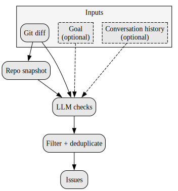

# Vet : Verify Everything

Vet is a standalone verification tool for **code changes** and **coding agent behavior**.

It reviews git diffs, and optionally an agent's conversation history, to find issues that tests and linters often miss. Vet is optimized for use by humans, CI, and coding agents.

## Installation

```bash
pip install git+https://github.com/imbue-ai/vet.git
```

## Quickstart

Run Vet in the current repo:

```bash
vet "Implement X without breaking Y"
```

Compare against a base ref/commit:

```bash
vet "Refactor storage layer" --base-commit main
```

## GitHub PRs (Actions)

Vet can run on pull requests.

Create `.github/workflows/vet.yml`:

```yaml
name: Vet

permissions:
  contents: read
  pull-requests: write
  issues: write

on:
  pull_request:
    types: [opened, edited, synchronize, reopened]

jobs:
  vet:
    if: github.event.pull_request.draft == false
    runs-on: ubuntu-latest
    steps:
      - uses: actions/checkout@v4
        with:
          fetch-depth: 0
      - uses: actions/setup-python@v5
        with:
          python-version: "3.11"
      - run: pip install git+https://github.com/imbue-ai/vet.git
      - name: Run vet
        if: github.event.pull_request.head.repo.full_name == github.repository
        env:
          ANTHROPIC_API_KEY: ${{ secrets.ANTHROPIC_API_KEY }}
          GH_TOKEN: ${{ secrets.GITHUB_TOKEN }}
          VET_GOAL: |
            ${{ github.event.pull_request.title }}

            Additional context (not necessarily part of the goal):
            ${{ github.event.pull_request.body }}
        run: |
          set +e
          vet "$VET_GOAL" --quiet --base-commit "${{ github.event.pull_request.base.sha }}" > "$RUNNER_TEMP/vet-output.txt" 2>&1
          status=$?
          if [ ! -s "$RUNNER_TEMP/vet-output.txt" ]; then
            echo "Vet found no issues." > "$RUNNER_TEMP/vet-output.txt"
          fi
          gh pr comment "${{ github.event.pull_request.number }}" --body-file "$RUNNER_TEMP/vet-output.txt"
          if [ "$status" -eq 1 ]; then exit 0; fi
          exit "$status"
```

NOTE: This will not fail in CI if Vet finds an issue. This will only add a comment to the PR.

#### Environment variables

- `ANTHROPIC_API_KEY` is required for the default model configuration.

## Using Vet with Coding Agents

Vet ships as an [agent skill](https://agentskills.io) that coding agents like [OpenCode](https://opencode.ai) and [Codex](https://github.com/openai/codex) can discover and use automatically. When installed, agents will proactively run vet after code changes and include conversation history for better analysis.

### Install the skill

```bash
for dir in ~/.agents ~/.opencode ~/.claude ~/.codex; do
  mkdir -p "$dir/skills/vet/scripts"
  curl -fsSL https://raw.githubusercontent.com/imbue-ai/vet/main/skills/vet/SKILL.md \
    -o "$dir/skills/vet/SKILL.md"
  curl -fsSL https://raw.githubusercontent.com/imbue-ai/vet/main/skills/vet/scripts/export_opencode_session.py \
    -o "$dir/skills/vet/scripts/export_opencode_session.py"
  curl -fsSL https://raw.githubusercontent.com/imbue-ai/vet/main/skills/vet/scripts/export_codex_session.py \
    -o "$dir/skills/vet/scripts/export_codex_session.py"
  curl -fsSL https://raw.githubusercontent.com/imbue-ai/vet/main/skills/vet/scripts/export_claude_code_session.py \
    -o "$dir/skills/vet/scripts/export_claude_code_session.py"
done
```

This places the skill in `~/.agents/skills/vet/`, `~/.opencode/skills/vet/`, `~/.claude/skills/vet/`, and `~/.codex/skills/vet/`, so it is discovered by OpenCode, Claude Code, and Codex.

## How it works

Vet snapshots the repo and diff, optionally adds a goal and agent conversation, runs LLM checks, then filters/deduplicates findings into a final list of issues.



## Why Vet

- **Verification for agentic workflows**: "the agent said it ran tests" is not the same as "all tests ran successfully".
- **CI-friendly safety net**: catches classes of problems that may not be covered by existing tests.
- **Bring-your-own-model**: can run against hosted providers or local/self-hosted OpenAI-compatible endpoints.
- **No telemetry collected by us**: Vet does not collect any user data.

## Output & exit codes

- Exit code `0`: no issues found
- Exit code `1`: issues found
- Exit code `2`: invalid usage/configuration error

Output formats:
- `text`
- `json`

## Configuration

### Model configuration

Vet supports custom model definitions using OpenAI-compatible endpoints via JSON config files searched in:

- `$XDG_CONFIG_HOME/imbue/models.json` (or `~/.config/imbue/models.json`)
- `models.json` at your repo root

#### Example `models.json`

```json
{
  "providers": {
    "openai": {
      "name": "OpenAI",
      "api_type": "openai_compatible",
      "base_url": "https://api.openai.com/v1",
      "api_key_env": "OPENAI_API_KEY",
      "models": {
        "gpt-4o": {
          "model_id": "gpt-4o-2024-08-06",
          "context_window": 128000,
          "max_output_tokens": 16384
        },
        "gpt-4o-mini": {
          "model_id": "gpt-4o-mini-2024-07-18",
          "context_window": 128000,
          "max_output_tokens": 16384
        },
        "o1": {
          "model_id": "o1-2024-12-17",
          "context_window": 200000,
          "max_output_tokens": 100000
        }
      }
    }
  }
}
```

Then:

```bash
vet "Harden error handling" --model gpt-4o-mini
```

### Configuration profiles (TOML)

Vet supports named profiles so teams can standardize CI usage without long CLI invocations.

Profiles set defaults like model choice, enabled issue codes, output format, and thresholds.

See [the example](https://github.com/imbue-ai/vet/blob/main/vet.toml) in this project.

## Privacy / telemetry

Vet does **not** collect telemetry and does not send usage data to external services.

If you configure Vet to use a hosted inference provider, that provider may log requests; selecting a provider is the user’s responsibility.
